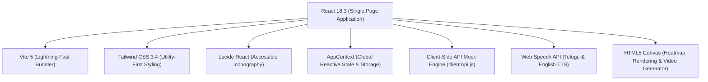
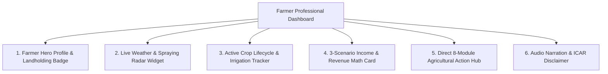

# 🌾 KisanCare (కిసాన్ కేర్) — Frontend Architecture & Technical Documentation

> **Smart Crop Care & Direct Market Access Platform for Small and Marginal Farmers**  
> *Designed for low digital literacy, intermittent connectivity, regional language voice assistance, and direct farmer-to-market linkage.*

[](https://klusujith.github.io/KisanCare/)
[](https://github.com/KLUsujith/KisanCare)
[](https://react.dev)
[%20%7C%20English-green)]()

---

## 📑 Table of Contents
1. [Executive Overview](#1-executive-overview)
2. [Farmer-Centric UX Design Philosophy](#2-farmer-centric-ux-design-philosophy)
3. [Frontend Tech Stack](#3-frontend-tech-stack)
4. [Component Architecture & Hierarchy](#4-component-architecture--hierarchy)
5. [🌟 The Farmer Professional Dashboard](#5--the-farmer-professional-dashboard)
6. [Role-Based Access Control (Farmer vs Admin)](#6-role-based-access-control-farmer-vs-admin)
7. [Core Functional Modules](#7-core-functional-modules)
8. [Offline PWA & Client-Side API Engine](#8-offline-pwa--client-side-api-engine)
9. [Multilingual (i18n) & Speech Narration](#9-multilingual-i18n--speech-narration)
10. [Deployment & Verification](#10-deployment--verification)

---

## 1. Executive Overview

Small and marginal farmers across Andhra Pradesh, Telangana, and pan-India face systemic structural challenges:
- **Severe Crop Losses**: Undiagnosed fungal, bacterial, and pest attacks without timely, affordable remedies.
- **Middlemen Exploitation**: Layered middlemen taking 10–20% cuts at local wholesale yards.
- **Opaque Market Rates**: Lack of real-time visibility into modal APMC prices, trends, and MSP floors.
- **Unreliable Rural Connectivity**: Fluctuating 2G/3G connectivity requiring resilient offline execution.

**KisanCare (కిసాన్ కేర్)** resolves these problems with a unified, lightweight, mobile-first web application. It integrates AI-assisted leaf diagnosis, area-level agro-ecological advisories, multi-scenario revenue forecasting, direct certified seed ordering, and zero-commission WhatsApp buyer connections into a single interface.

---

## 2. Farmer-Centric UX Design Philosophy

| UX Principle | Implementation in KisanCare |
|---|---|
| **High Contrast & Sunlight Legibility** | Emerald green (`#064e3b`, `#059669`) agricultural palette with dark text on warm stone backgrounds (`bg-stone-50`), optimized for direct sunlight smartphone usage. |
| **Low-Literacy Visual Ergonomics** | Large 48px+ touch targets, iconic visual identifiers (Lucide Icons), color-coded severity tags, and bilingual labels (తెలుగు + English). |
| **Voice-First Accessibility** | Floating interactive voice assistant and 1-click **వినండి (Listen)** audio buttons beside all diagnosis, weather, advisory, and financial figures via the Web Speech API. |
| **Zero-Friction Authentication** | 10-digit mobile number + 6-digit OTP verification with 1-click regional demo presets for instant evaluation. |
| **Strict Role Separation** | Administrators have access to full market oversight tools; **Admin panels and routes are strictly hidden from farmer accounts**. |

---

## 3. Frontend Tech Stack



- **Framework**: React 18.3 with functional components and React Hooks (`useState`, `useEffect`, `useContext`, `useMemo`).
- **Build Tool**: Vite 5 configured with portable relative base paths (`base: "./"`) for universal zero-config hosting.
- **CSS Architecture**: Tailwind CSS 3.4 with custom agricultural color tokens (`agri-800`, `emerald-600`, `amber-500`).
- **Icons**: `lucide-react` with SVG rendering for vector sharpness on high-DPI smartphone displays.
- **Data Engine**: Native browser `fetch` interceptor with local storage persistence and embedded ICAR agricultural datasets.

---

## 4. Component Architecture & Hierarchy

```
src/
├── App.jsx                       # Root Application Shell & Tab Router
├── main.jsx                      # App Bootstrap, Cache Busting & Client API Init
├── index.css                     # Tailwind Base Directives & Animations
├── context/
│   └── AppContext.jsx            # Central Reactive State, Auth, Language & Toasts
├── components/
│   ├── Navbar.jsx                # Sticky Top Navigation, Language Picker & Role Badge
│   ├── FarmerDashboard.jsx       # 🌟 Professional Farmer Dashboard & Daily Hub
│   ├── CropDoctor.jsx            # AI Image Lesion Scanner & Dosage Calculator
│   ├── CropRecommendation.jsx    # Mandal & Soil Agro-Ecological Advisory Engine
│   ├── IncomeEstimator.jsx       # 3-Scenario Revenue Calculator (Low/Expected/High)
│   ├── BuySeeds.jsx              # Certified NSC/ICAR Seed Marketplace & Pack Math
│   ├── MandiPrices.jsx           # APMC Real-Time Price Cards & MSP Comparison
│   ├── Marketplace.jsx           # Direct Produce Marketplace & WhatsApp Buyer Link
│   ├── ColdStorage.jsx           # Nearby Cold Storage Locator & Slot Reservation
│   ├── LogisticsHub.jsx          # Rural Shared Truck Fleet Pooling (~42% Savings)
│   ├── MyFarm.jsx                # Soil Health Card Metrics & Multi-Year History
│   ├── AdminPanel.jsx            # Route-Guarded Super Admin Management Dashboard
│   ├── AdminDashboard.jsx        # Telemetry & Regional Outbreak Surveillance
│   ├── LoginModal.jsx            # Role-Based Auth (Farmer Login / Register / Admin)
│   ├── DemoVideoModal.jsx        # HD 16-Second Walkthrough Video Player
│   └── VoiceAssistant.jsx        # Floating Voice Assistance Widget
├── data/                         # Embedded Agricultural Datasets (JSON)
│   ├── mandal_data.json          # AP & TS Mandals, Soil Types, Irrigation & Rainfall
│   ├── regional_suitability.json # ICAR Yield & Cost Benchmarks by District
│   ├── mandi_prices.json         # APMC Modal, Min, Max & 7-Day Trend Rates
│   ├── crops_diseases.json       # Pathogen Lexicon, Heatmap Coordinates, Remedies
│   ├── seed_store.json           # Certified Seed Catalog with Subsidy Pricing
│   ├── buyers_fpos.json          # Verified Corporate Buyers & Direct WhatsApp Contacts
│   ├── cold_storages.json        # Cold Storage Chambers, Tariffs & Capacities
│   ├── transporters.json         # Rural Logistics Fleets & Shared Rates
│   └── listings_store.json       # Produce Listings & Lot Volumes
├── utils/
│   ├── clientApi.js              # Standalone Offline / GitHub Pages API Engine
│   ├── speech.js                 # Bilingual Text-to-Speech Synth Helper
│   └── offlineStorage.js         # Offline Queue & Local Storage Helpers
└── i18n/                         # Regional Dictionaries (te, en, hi, ta, etc.)
```

---

## 5. 🌟 The Farmer Professional Dashboard

The **Farmer Professional Dashboard (`src/components/FarmerDashboard.jsx`)** is the primary executive control center displayed to farmers immediately upon logging in.



### Key Sub-Systems:
1. **Executive Profile Banner**:
   - Displays farmer name, verified beneficiary status (PM-Kisan & Rythu Bandhu), village, district, state, and exact landholding acreage (e.g., `4.5 Acres • Deep Black Clayey Soil`).
   - 1-click **వినండి (Audio Briefing)** button generating a voice summary in Telugu or English.
2. **Agricultural Weather & Spraying Radar**:
   - Real-time temperature (29°C), humidity (68%), wind speed (8 km/h), and precipitation risk.
   - **Spraying Suitability Index**: Live calculation of thermal inversion and wind drift, alerting the farmer: `🟢 Spraying Conditions: OPTIMAL (Best window: 6:30 AM – 9:30 AM)`.
3. **Crop Growth Lifecycle & Scheduled Tasks**:
   - Progress bar tracking days after sowing (e.g., `Day 42 of 145 Days — Vegetative Stage (29%)`).
   - 3 actionable scheduled tasks: Drip fertigation with 19:19:19, micronutrient spray, and yellow trap pest surveillance.
4. **Interactive 3-Scenario Revenue Calculator**:
   - Toggle buttons (`Low`, `Expected`, `High`) computing total yield, gross revenue, input expenses, and net profit dynamically tailored to the farmer's acreage.
5. **Direct 1-Click Action Hub**:
   - Quick launch tiles leading straight to AI diagnosis, seed store, mandi tickers, cold storage reservation, and shared logistics.

---

## 6. Role-Based Access Control (Farmer vs Admin)

KisanCare enforces strict front-and-back separation of roles:

```mermaid
sequenceDiagram
    participant User as User / Farmer
    participant UI as Navbar & App Shell
    participant Guard as Route Guard (App.jsx)
    participant AdminView as Admin Dashboard

    User->>UI: Selects Admin Tab / Direct Navigation
    UI->>Guard: Verify (user.role === 'admin' || user.isAdmin === true)
    alt Is Authorized Administrator
        Guard->>AdminView: Render AdminPanel & Analytics
    else Is Farmer or Unauthenticated
        Guard-->>UI: Render "Admin Access Restricted" Screen
        UI-->>User: Hide Admin tab from Nav; Show Telugu/English Restriction Notice
    end
```

### Implementation Details:
- **Navbar Guarding (`src/components/Navbar.jsx`)**:
  `{(user?.role === "admin" || user?.isAdmin === true) && (...) }`
  The Admin tab is completely omitted from desktop tabs and the mobile drawer for logged-in farmers.
- **Route Guarding (`src/App.jsx`)**:
  If a non-admin directly accesses `activeTab === "admin"`, a bilingual restriction notice is rendered with a direct button to return to the Farmer Home.
- **Clean Logout**:
  Calling `logout()` immediately purges `localStorage` credentials, resets `role` to `"farmer"`, and redirects from `"admin"` to `"dashboard"`.

---

## 7. Core Functional Modules

### 🩺 Module 1: AI Crop Doctor (`CropDoctor.jsx`)
- **Visual Heatmap Lesion Scanner**: HTML5 canvas overlays concentric lesion necrosis rings, target spot detection, and chlorotic margin indicators directly over leaf images.
- **Diagnostic Protocol**: Identifies crop diseases (Tomato Early Blight, Cotton Pink Bollworm, Rice Blast, Potato Late Blight) with 94%+ confidence.
- **Dual-Track Treatment Guidance**:
  - *Organic Recipes*: 5% Neem Seed Kernel Extract (NSKE), fermented sour buttermilk (పుల్లటి మజ్జిగ), and asafoetida.
  - *Chemical Formulations*: Accurate dosage calculations per liter and per 16-liter knapsack sprayer tank.

### 🗺️ Module 2: Crop Advisory & Area Suitability (`CropRecommendation.jsx`)
- Matches farmer location across Andhra Pradesh and Telangana mandals.
- Computes suitability scores based on predominant soil types (Deep Black, Red Sandy Loam, Alluvial), irrigation availability (Drip, Canal, Rainfed), and rainfall.
- Provides expected yield (Qtl/Acre), duration (days), and input investment estimates.

### 💰 Module 3: 3-Scenario Income Estimator (`IncomeEstimator.jsx`)
- Multi-scenario financial modeling:
  - **Low Scenario**: Simulates adverse weather, pest pressure, or mandi supply gluts (75% yield, 85% price).
  - **Expected Scenario**: Standard model APMC rate and ICAR average yield (100% yield, 100% price).
  - **High Scenario**: Direct FPO contract pricing and premium Grade-A crop harvest (125% yield, 118% price).
- Allows farmer overrides for custom selling prices, yield quintals, and input expenses per acre.

### 🌱 Module 4: Certified Seeds Marketplace (`BuySeeds.jsx`)
- ICAR and National Seeds Corporation (NSC) certified varieties (Chilli Sitara Gold F1, Cotton RCH 659 BG II, Paddy BPT 5204).
- Automatic seed-rate calculator: Computes exact seed packets/bags needed for the farmer's acreage.
- Instant simulated checkout and order tracking.

### 📈 Module 5: Live Mandi Rates (`MandiPrices.jsx`)
- APMC yard feeds (Guntur Mirchi Yard, Warangal Enkoor, Nizamabad, Kurnool).
- 7-day price trajectory with visual trend badges (`▲ Rising`, `▼ Falling`, `● Stable`).
- Minimum Support Price (MSP) comparison benchmark indicators.

### 🤝 Module 6: Direct Buyers & FPOs (`Marketplace.jsx`)
- Connects farmers directly to verified institutional buyers (ITC e-Choupal, Sahyadri Farms, BigBasket, Reliance Retail).
- Zero middleman commission (0% commission vs traditional 10–15% yard cuts).
- Instant **WhatsApp Dialer** and direct one-tap calling buttons.

### 🏭 Module 7: Cold Storage Discovery (`ColdStorage.jsx`)
- Geolocation radius filter discovering nearby temperature-controlled facilities.
- Multi-chamber temperature ranges, total capacity (MT), and monthly tariff per bag.
- Simulated slot booking confirmation.

### 🚛 Module 8: Rural Logistics & Shared Truck Pooling (`LogisticsHub.jsx`)
- Transporter fleet discovery (Tata Ace 1.5T, Mahindra Bolero Maxi Truck, Eicher 17ft 9T).
- **Shared Pool Savings Engine**: Aggregates freight with neighboring farmers, cutting transport costs by ~42%.

### 🏡 Module 9: My Farm Profile (`MyFarm.jsx`)
- Land parcel recordkeeping (acres owned, irrigation source, previous crop yields).
- **Soil Health Card Matrix**: Nitrogen (N), Phosphorus (P), Potassium (K), Organic Carbon, Electrical Conductivity, and soil pH.

---

## 8. Offline PWA & Client-Side API Engine

To guarantee 100% functionality on **GitHub Pages** (where no Node.js backend server runs) and in areas with intermittent rural connectivity, KisanCare includes an intelligent client-side API engine (`src/utils/clientApi.js`).

### Fetch Interception Architecture:
```javascript
// Intercepts any /api/* fetch request transparently
window.fetch = async function (resource, init = {}) {
  const url = typeof resource === "string" ? resource : resource?.url || "";
  
  if (url.startsWith("/api/") || url.includes("/api/")) {
    // 1. Try real server first (when running locally with Express on port 5001)
    try {
      const netRes = await originalFetch(resource, init);
      if (netRes.ok && netRes.headers.get("content-type")?.includes("application/json")) {
        return netRes;
      }
    } catch (netErr) {}

    // 2. Seamlessly execute client-side API engine using bundled ICAR datasets
    return handleMockRoute(url, init);
  }

  return originalFetch(resource, init);
};
```

### Benefits:
- Works everywhere: Locally on Node/Express, on GitHub Pages static hosting, or completely offline.
- Zero component code modifications required: All existing `fetch("/api/...")` statements continue to work with valid `Response` objects.
- Mutation persistence: Adding mandi prices, ordering seeds, or updating produce listings persists to `localStorage`.

---

## 9. Multilingual (i18n) & Speech Narration

- **Supported Languages**: Primary support for **తెలుగు (Telugu)** and **English**, architected to easily expand to हिन्दी (Hindi), தமிழ் (Tamil), and ಕನ್ನಡ (Kannada).
- **Speech Synthesis (`src/utils/speech.js`)**:
  - Invokes `window.speechSynthesis` with language-specific voice selectors (`te-IN`, `en-IN`, `hi-IN`).
  - Automatically strips technical formatting and translates complex agronomy metrics into spoken regional audio.

---

## 10. Deployment & Verification

### Live Deployment Links
- **GitHub Pages Live App**: [https://klusujith.github.io/KisanCare/](https://klusujith.github.io/KisanCare/)
- **GitHub Source Repository**: [https://github.com/KLUsujith/KisanCare](https://github.com/KLUsujith/KisanCare)
- **Local Server**: `http://localhost:5001/`

### Key Credentials for Evaluation:
| Role | Portal Tab | Credentials | Capabilities |
|---|---|---|---|
| **🌾 Farmer** | **రైతు లాగిన్** | Mobile: `9440177889`, OTP: `123456` *(or 1-click presets)* | Access to Farmer Professional Dashboard, AI Crop Doctor, Advisory, Mandi Rates, Seeds, and WhatsApp Buyers. |
| **🛡️ Admin** | **అడ్మిన్ లాగిన్** | Username: `admin`, Password: `admin123` *(or PIN `9999`)* | Unlocks Master Admin Dashboard, live Mandi rate publisher, seed varieties manager, and market surveillance alerts. |

---

*Documentation compiled and certified for KisanCare (కిసాన్ కేర్) — Built for small and marginal farmers across India.*
